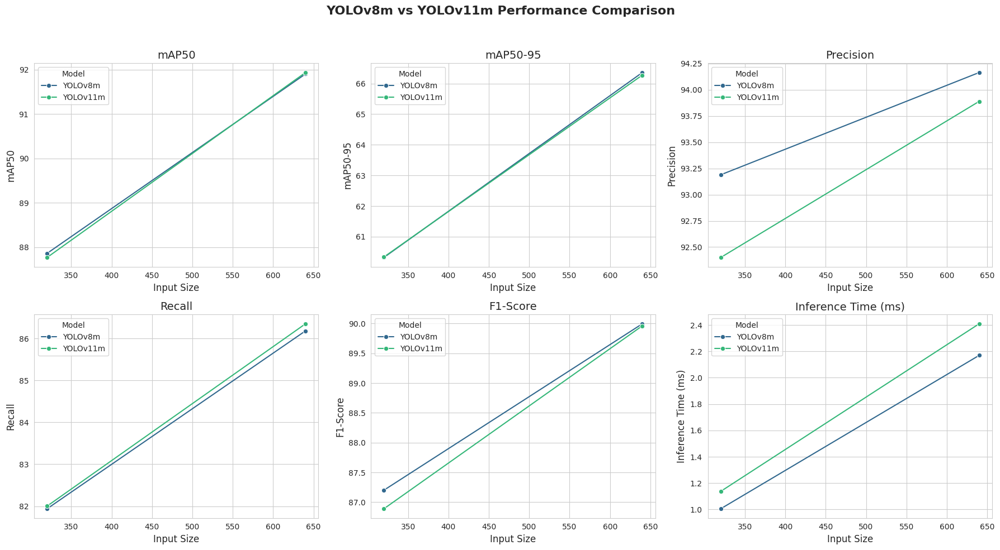

# YOLOv8m vs YOLOv11m: Training and Comparison

## 📌 Overview

This project trains and compares two object detection models, **YOLOv8m** and **YOLOv11m**, using the same dataset from **Ultralytics HUB**. The comparison includes performance evaluation metrics, inference speed, and visualization of results.

## 🚀 Model Details

| Model    | Ultralytics HUB Link                                            |
| -------- | --------------------------------------------------------------- |
| YOLOv8m  | [Link](https://hub.ultralytics.com/models/7uCkqGxvfW5Ld82LMfHy) |
| YOLOv11m | [Link](https://hub.ultralytics.com/models/7NIpjKj8EUH0xT8X7ZeE) |

## 📂 Dataset

The dataset used for training and validation is **hosted on Ultralytics HUB** ([Dataset Link](https://hub.ultralytics.com/datasets/CQiMV1caDueK6J2s0ghA)). It contains labeled images for safety helmet and vest detection.

## 🛠 Training Process

Both models were trained using the same dataset and hyperparameters. The training command used for each model:

### **Train YOLOv8m**

```bash
yolo task=detect mode=train model=yolov8m.pt data=ultralytics/datasets/Safety Helmet and Vest dataset epochs=100 imgsz=640
```

### **Train YOLOv11m**

```bash
yolo task=detect mode=train model=yolov11m.pt data=ultralytics/datasets/Safety Helmet and Vest dataset epochs=100 imgsz=640
```

### **Validation**

After training, the models were evaluated using the validation dataset:

```bash
yolo task=detect mode=val model=yolov8m.pt data=ultralytics/datasets/Safety Helmet and Vest dataset imgsz=640

yolo task=detect mode=val model=yolov11m.pt data=ultralytics/datasets/Safety Helmet and Vest dataset imgsz=640
```

## 📊 Results Comparison

| Metric              | YOLOv8m (640) | YOLOv8m (320) | YOLOv11m (640) | YOLOv11m (320) |
| ------------------- | ------------- | ------------- | -------------- | -------------- |
| mAP50               | 91.901322%           | 87.860558%           | 91.933984%            | 87.768032%            |
| mAP50-95            | 66.358764%           | 60.321393%           | 66.274151%            | 60.337352%            |
| Precision           | 94.163463%           | 93.188866%           | 93.888522%            | 92.400624%            |
| Recall              | 86.179337%           | 81.938057%           | 86.348320%            | 82.000746%            |
| F1-Score            | 89.994614%           | 87.202015%           | 89.960649%            | 86.890553%            |
| Inference Time (ms) | 2.169583             | 1.005517             | 2.409280              | 1.137418              |

📈 Performance Visualization

The following charts illustrate the performance of both models at different input resolutions (640x640 and 320x320):

📌 Prediction Results

Here are the prediction results for both models on different input sizes:

YOLOv8m Predictions

📌 640x640 Resolution


📌 320x320 Resolution


YOLOv11m Predictions

📌 640x640 Resolution


📌 320x320 Resolution


## 📌 Uploaded Files

The repository includes the following files:

Train the models on (ultralytics Hub)

compare8and11.ipynb (Google Colab notebook for model comparison)

yolo_comparison_results_640_320.csv (CSV containing comparison metrics)

helmet_vest_yolo11m.pt (Trained YOLOv11m model)

helmet_vest_yolov8m.pt (Trained YOLOv8m model)

Four prediction images for different test cases


## 📌 CSV Results

The detailed results for both models are stored in:

- `test_result/yolo_comparison_results_640_320.csv`

## 🏆 Conclusion

- **YOLOv8m**: Best for **faster inference** while maintaining good accuracy.
- **YOLOv11m**: Best for **higher accuracy** but slightly **slower inference**.
- The choice depends on whether you prioritize **speed or accuracy** for deployment.


